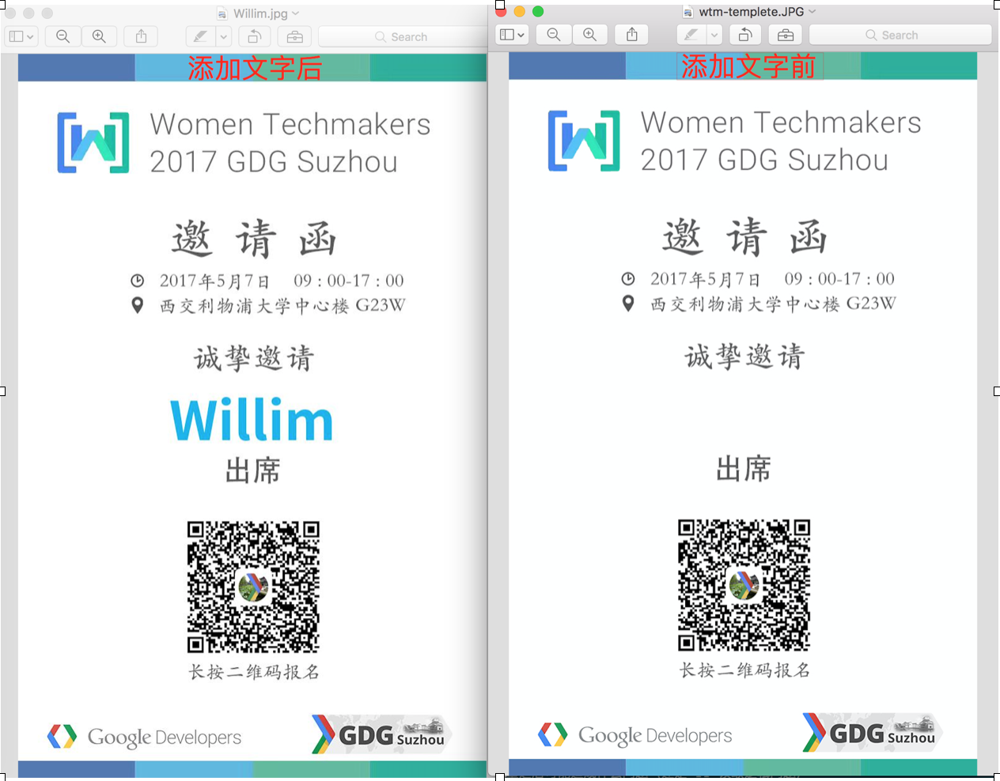

# wechat-invitation

给一个活动图片当做模板，批量添加邀请人姓名。用于活动邀请，传播

## 效果




## 使用方法

修改 config.yml 配置，修改输入文件、模板、颜色、输出目录
执行
```
# 安装依赖
# pip install -r requirements.txt
# python run.py
```

##  项目依赖
- [Google 开源字体](https://github.com/adobe-fonts/source-han-sans)
- [图片处理 Pillow](https://github.com/python-pillow/Pillow)
- [命令行接口自动生成](https://github.com/google/python-fire)
- [RGB 颜色挑选](http://tool.oschina.net/commons?type=3)
